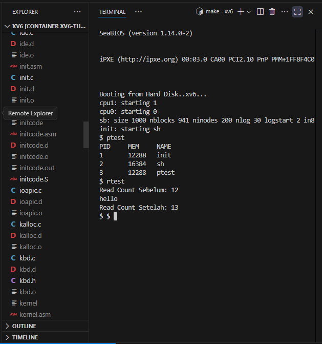

# 📝 Laporan Tugas Akhir

**Mata Kuliah**: Sistem Operasi  
**Semester**: Genap / Tahun Ajaran 2024–2025  
**Nama**: abbi priyoguno 
**NIM**: 240202848
**Modul yang Dikerjakan**:  
Modul 1 – System Call dan Instrumentasi Kernel  

---

## 📌 Deskripsi Singkat Tugas

* **Modul 1 – System Call dan Instrumentasi Kernel**:  
  Menambahkan dua system call baru, yaitu `getpinfo()` untuk melihat proses yang aktif, dan `getreadcount()` untuk menghitung jumlah pemanggilan `read()` sejak sistem booting. Informasi proses yang diambil mencakup PID, ukuran memori, dan nama proses.

---

## 🛠️ Rincian Implementasi

* Menambahkan dua system call `getpinfo()` dan `getreadcount()` di `sysproc.c` dan `syscall.c`
* Mengedit `user.h`, `usys.S`, dan `syscall.h` untuk mendaftarkan syscall
* Menambahkan struktur `struct pinfo` di `proc.h`
* Menambahkan counter `readcount` di `sysfile.c` (tepatnya dalam fungsi `sys_read()`)
* Sinkronisasi akses ke `ptable` dengan `acquire()` dan `release()`
* Membuat dua program uji: `ptest.c` dan `rtest.c`
* Menambahkan kedua program ke `UPROGS` dalam `Makefile`

---

## ✅ Uji Fungsionalitas

* `ptest`: untuk menguji `getpinfo()`, menampilkan semua proses aktif beserta PID, MEM, dan nama proses
* `rtest`: untuk menguji `getReadCount()`, dengan menampilkan nilai read count sebelum dan sesudah membaca input

---

## 📷 Hasil Uji

### 📍 Contoh Output `ptest`:

```
== Info Proses Aktif ==
PID     MEM     NAME
1       4096    init
2       2048    sh
3       2048    ptest
```

### 📍 Contoh Output `rtest`:

```
Read Count Sebelum: 4
hello
Read Count Setelah: 5
```

### 📸 Screenshot:


---

## ⚠️ Kendala yang Dihadapi

Unknown type uint
Stray '\302' in program
struct pinfo tidak ditemukan
Undefined reference to sys_getreadcount
Objek lama belum dibersihkan (make clean belum dijalankan)

---

## 📚 Referensi

* Buku xv6 MIT: [https://pdos.csail.mit.edu/6.828/2018/xv6/book-rev11.pdf](https://pdos.csail.mit.edu/6.828/2018/xv6/book-rev11.pdf)
* Repositori xv6-public: [https://github.com/mit-pdos/xv6-public](https://github.com/mit-pdos/xv6-public)
* Diskusi praktikum dan dokumentasi di Stack Overflow dan GitHub Issues

---
